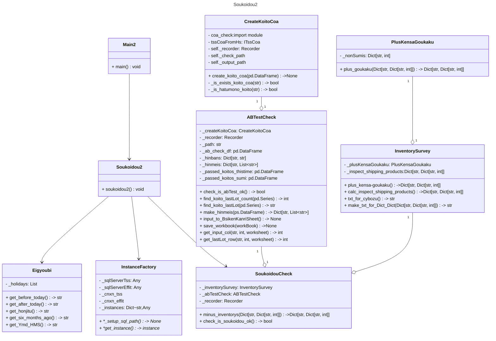

# デジタル部長について
## システム概要
### 動作環境
- OS  
    - Windows11(main.py:soukoidou,  main2.py:soukoidou2)
    - Linux(Ubuntu)->サイボウズへの書き込みは不可それ以外は動作OK
- インストール先
    - 和泉PC, 徳武PC
    - 尾頭PC(toyo-pc12) WSL2(Ubuntu)で開発
### 構築システム
- メインシステム: Python3.10
- Windowsスクリプト(soukoidou.bat, soukoidou2.bat)
### ソースコード
GitHub Publicリポジトリで公開 
[GitHub_ https://github.com/ogashira/DigitalManager](https://github.com/ogashira/DigitalManager)

| soukoidou                        | soukoidou2                | 
| :---                             | :---                      | 
|  main.py                         | main2.py                  | 
|  soukoidou.py                    | soukoidou2.py             | 
|  eigyoubi.py                     | eigyoubi.py               |
|  uninspected_products_survey.py  | inventory_survey.py       |                          
|  inventory_survey.py             | soukoidou_check.py        |
|  create_export_coa.py            | create_koito_coa.py       |
|  fetch_data.py                   |                           |
|  recorder.py                     |                           |
|  cybozu.py                       |                           |
  
### 起動方法
##### soukoidou
- `Winボタン+R -> soukoidou入力 -> Enter`または`DigitalManager/soukoidou`デイレクトリ内にて`python main.py`で実行

### 動作
#### 「成績書作成」ToyoKogyoHsRepBat.exe, TyoKogyoMhsRepBat.exe
- returncode 
    - 1: 正常終了
    - 2: 正常終了（初物登録あり）
    - 3: パラメータ未指定
    - 4: DBに対象の値が存在しない
    - 5: 向先シート表に対象の値が存在しない
    - 6: 発行する製品のLOTが輸出塗料連絡表にない
    - 7: 検査NGのため成績書を発行できない
    - 8: 向先シート表に成績書の設定がない
    - 9: 成績表の作成に失敗
    - 99: 不明なエラー
#### 「effitAへ出力」ToyoKogyoHsBat.exe
- returncode = {1:成功, 2:倉庫移動フォルダにファイル有り失敗, 3:失敗}
- (移動カラム=NULLまたは、特) and 判定カラム=合格　で、実行される。
- 移動カラム「中」では実行されない
- 実行後は自動で移動カラム=済になる
#### 和泉課長打合せ議事録
- 2026/2/20 TSSの品質管理で「effitへ出力」を行うと、移動カラムは「中」になる。 無事にcsvファイルがeffit倉庫移動フォルダに移動した時点で、 デジタル部長に「中」-> 「済」に変更するようにしてもらう。
- 2026/2/20 特採の場合、デジタル部長にはやってもらわず、手動で倉庫移動する。 移動カラムも「特」に変更せず、空欄のままにしておく。 その後、検査担当が「合格」に変更すれば、デジタル部長が倉庫移動かける。
固定リンク  削除する
#### soukoidou
##### 営業日計算 
1. 前稼働日、本日、翌稼働日、6ヵ月前の年月日を計算
##### 未検査製品の抽出
1. 品質管理、メタル品質管理に登録されていて検査が終了していない製品を抽出する
1. 上製品をサイボウスにアップする。
##### 翌日出荷製品の抽出
1. 翌稼働日に出荷予定の製品を抽出する。
1. 上製品の現在庫と出荷数を求め本日中に倉庫移動しなければならない製品を明確にする。
1. ただし、営業部で出荷処理済の製品は表示しない。
1. 上情報をサイボウズにアップする。
##### 輸出成績書作成
1. 輸出塗料連絡表で、発送日が前稼働日かつ、「成績書記載名称」が "-" でない製品を抽出する。
1. `.../testreport/輸出/` に既に存在するか? それは「初物」か?をチェックする。
1. `.../testreport/zip_files/<納入日フォルダ>/送信済/*.zip` に成績書があるかをチェックする。
1. 上記は既に提出済または、`.../testreport/輸出/`に「初物」でない成績書がある場合は新たに検査成績書は作成しないということ。
1. 品質検査、メタル品質検査から6ヵ月前から本日までのLotをfetchして、作成しなければならないLotがどちらのデータベースに存在するのかを調べる。
1. 品質検査に登録されている製品は`\\192.168.1.247\共有\TSS_System\TssSystem\ToyoKogyo\Bat\ToyoKogyoHsRepBat\TyoKogyoHsRepBat.exe`を使って成績書を作成する。
1. メタル品質検査に登録されている製品は`\\192.168.1.247\共有\TSS_System\TssSystem\ToyoKogyo\Bat\ToyoKogyoMhsRepBat\TyoKogyoMhsRepBat.exe` を使って成績書を作成する。
---
#### soukoidou2
##### マイナス在庫が無く倉庫移動可能か調査
1. 今日中に倉庫移動が必要な製品(検査する出荷製品) 
self.inspect_shipping_products: Dict= {'S6-SV3800-U':{'出荷':20, '現在庫':100, '出荷後':80}, ....} を求める
1. inspect_shipping_productsの['出荷後']がマイナスになっている品番が品質管理、メタル品質管理で検査終了になっているかを調べる。
1. minus_inventorys:Dictを作る。また、検査合格で済でない小糸のAB試験チェックも行い、minus_inventoryが空で、ABチェックも合格でないと倉庫移動はかけられない。 

##### 小糸成績書発行
1. 小糸AB試験チェック
    1. 品質管理のAB試験が間違っていないかチェック
        1. 間違っていたら倉庫移動しない。-> 中止
        1. 間違っていたら成績書発行しない。-> 中止　
1. 小糸成績書発行の是非調査 (国内メタル成績書は不要。syukkaロボットが行う) 
    1. 櫻田フォルダに小糸成績書があるか？ 
    1. ABチェックフォルダに小糸成績書があるか？
1. 小糸成績書発行->上の条件をクリアしていれば、直接櫻田フォルダに入れても良い
##### effitA倉庫移動
1. 倉庫移動.csv作成
1. 倉庫移動実施
1. サイボウズに結果をアップする

### クラス図

